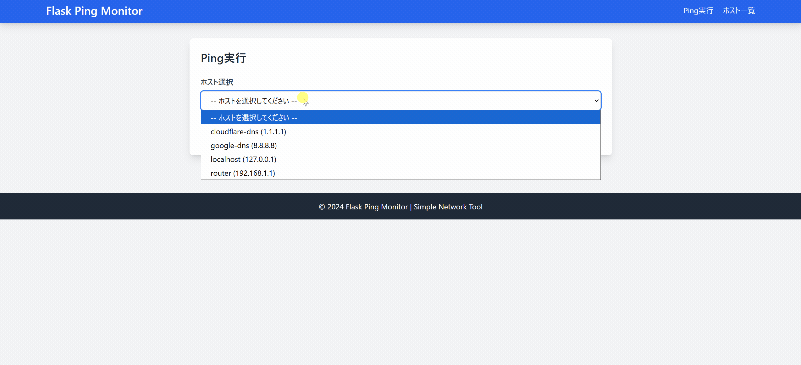

# Flask Ping Monitor

シンプルなネットワーク監視ツール。SQLiteでホスト情報を管理し、Ping実行・CRUD操作が可能なローカルWebアプリケーションです。

Windows / WSL / Linux / macOS の実行環境差異を考慮して設計しており、実務で遭遇しやすい課題を意識した構成になっています。

**🔗 デモ画像:**



## 🚀 特徴

- **Ping実行**: ホストを選択して5回Pingを実行し、結果を表示
- **ホスト管理**: ホスト名とIPアドレスのCRUD操作
- **CSVインポート**: 既存のホストリストを一括登録
- **クロスプラットフォーム対応**: OSごとの ping オプション差異を吸収
- **シンプルUI**: Tailwind CSSによる見やすいインターフェース
- **ローカル専用**: 認証なしで簡単に使用可能

## 📋 必要環境

- Python 3.9以上
- WSL2 / Linux / macOS (Windows版は`start.bat`使用)

## 🔧 セットアップ

### 1. リポジトリのクローン
```bash
git clone https://github.com/Sohey-k/flask-ping-monitor.git
cd flask-ping-monitor
```

### 2. 仮想環境の作成
```bash
python3 -m venv venv # Windows: python -m venv venv
source venv/bin/activate # Windows: venv\\Scripts\\activate
```

### 3. 依存パッケージのインストール
```bash
pip install -r requirements.txt
```

### 4. データベース初期化
```bash
python3 database.py # Windows: python database.py
```

### 5. サンプルデータのインポート（オプション）
```bash
python3 csv_import.py # Windows: python csv_import.py
```

## 🎯 起動方法

### Linux / WSL / macOS
```bash
source venv/bin/activate
python3 app.py
```

### Windows
```batch
start.bat
```

ブラウザで `http://localhost:5000` にアクセス

## 📖 使い方

### Ping実行
1. トップページでホストを選択
2. 「Ping実行」ボタンをクリック
3. 結果が表示される

### ホスト管理
- **一覧表示**: ナビゲーションから「ホスト一覧」
- **新規登録**: 一覧ページの「新規登録」ボタン
- **編集**: ホストを選択して「編集」ボタン
- **削除**: ホストを選択して「削除」ボタン

### CSVインポート
1. `data/sample_hosts.csv` を参考にCSVファイルを作成
2. CSV形式: `hostname,ip_address`
3. `python3 csv_import.py` を実行

## 🗂️ プロジェクト構成
```
flask-ping-monitor/
├── app.py                 # メインアプリケーション
├── database.py            # DB操作関数
├── csv_import.py          # CSVインポートスクリプト
├── requirements.txt       # 依存パッケージ
├── start.bat              # Windows起動用バッチ
├── hosts.db               # SQLiteデータベース
├── data/
│   └── sample_hosts.csv   # サンプルCSVデータ
└── templates/
    ├── base.html          # ベーステンプレート
    ├── index.html         # Ping実行ページ
    ├── list.html          # 一覧ページ
    ├── edit.html          # 編集・削除ページ
    ├── add.html           # 新規登録ページ
    └── import.html        # インポートページ
```

## 🛠️ 技術スタック

- **Backend**: Flask 3.0.0
- **Database**: SQLite3
- **Frontend**: HTML + Tailwind CSS (CDN)
- **Language**: Python 3.9+

## 📝 データベーススキーマ

### hosts テーブル

| カラム名 | 型 | 制約 | 説明 |
|---------|-----|------|------|
| id | INTEGER | PRIMARY KEY | 自動採番ID |
| hostname | TEXT | NOT NULL UNIQUE | ホスト名 |
| ip_address | TEXT | NOT NULL | IPアドレス |
| created_at | TIMESTAMP | DEFAULT CURRENT_TIMESTAMP | 登録日時 |
| updated_at | TIMESTAMP | DEFAULT CURRENT_TIMESTAMP | 更新日時 |

## 🔒 セキュリティ

- ローカル環境専用（外部公開非推奨）
- SQLインジェクション対策: パラメータ化クエリ使用
- コマンドインジェクション対策: IPアドレスバリデーション

## 🤖 AIとの協業について

本プロジェクトは ChatGPT を活用したペアプログラミング形式 で開発しました。
- 設計レビュー
- OS差異（Windows / Linux / WSL）の洗い出し
- エラー原因の切り分けと思考整理
- README・コードのリファクタリング
を人間主導で行い、「考え方の補助ツール」としてAIを利用しています。
※単なるコード生成ではなく、実務を想定した試行錯誤・デバッグを重視しています。

## 📄 ライセンス

MIT License

## 👤 作成者

Sohey-K ([@Sohey-k](https://github.com/Sohey-k))

## 🙏 謝辞

実務で作成し使用していたネットワーク監視ツールの知見をベースに、 CRUD機能・Web UI・クロスプラットフォーム対応を追加して作成しました。